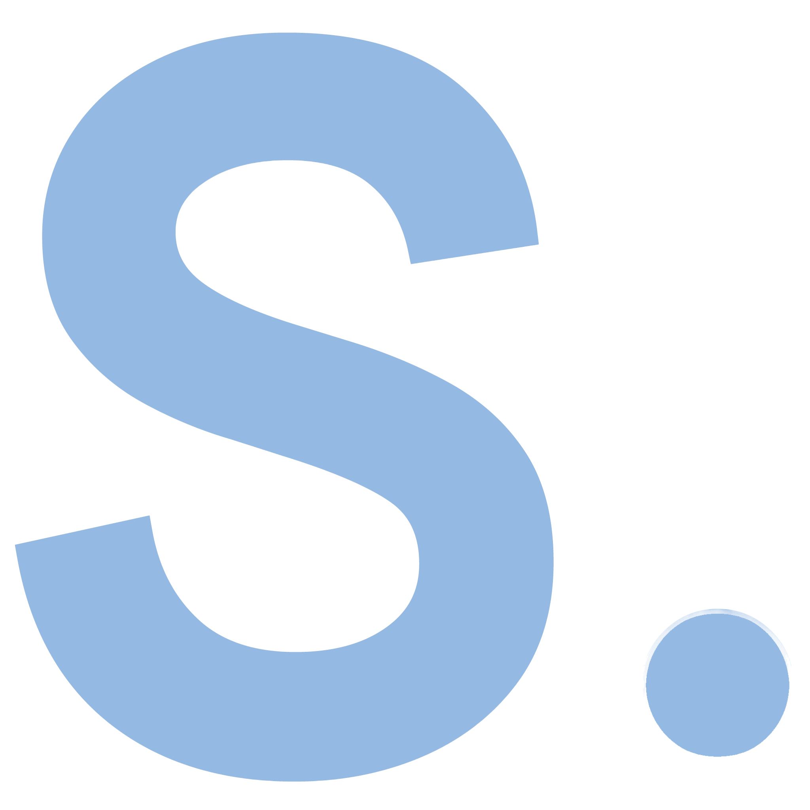

```html
<script src="https://cdnjs.cloudflare.com/ajax/libs/mathjs/9.3.2/math.js"></script>
<script src="https://SimpleJS-AI.github.io/SimpleJS-lib/lib/simple.js"></script>
```
<a name="readme-top"></a>

[![Contributors][contributors-shield]][contributors-url]
[![Forks][forks-shield]][forks-url]
[![Stargazers][stars-shield]][stars-url]
[![Issues][issues-shield]][issues-url]
[![MIT License][license-shield]][license-url]


<!-- PROJECT LOGO -->
<br />
<div align="center">
  <a href="https://github.com/flug8/SimpleJS-lib">
    
  </a>

<h3 align="center">SimpleJS</h3>

  <p align="center">
    description
    <br />
    <a href="https://github.com/flug8/SimpleJS-lib/wiki"><strong>Explore the docs »</strong></a>
    <br />
    <br />
    <a href="https://simplejs.ai">Visit Website</a>
    ·
    <a href="https://github.com/flug8/SimpleJS-lib/issues">Report Bug</a>
    ·
    <a href="https://github.com/flug8/SimpleJS-lib/issues">Request Feature</a>
  </p>
</div>


<!-- ABOUT THE PROJECT -->
## About The Project
SimpleJS is a JavaScript based machine learning library. It is designed to be simple and easy to use and still to be fast and efficient. It is built on top of the [Math.js](https://mathjs.org/) library.

The library includes these learning algorithms:
* Backpropagation based on gradient descent
* Genetic algorithm

Backpropagation is a supervised learning algorithm. It is used to train neural networks. 
The genetic algorithm is an unsupervised learning algorithm. It can be used without any prior knowledge of the data.

<p align="right">(<a href="#readme-top">back to top</a>)</p>

<!-- GETTING STARTED -->
## Installation

This is an example of how you may implement the library in your project.
To include the library in your project, follow these simple example steps.

### Prerequisites

To be able to use the library, you need to have it included in your HTML file like this:
(Don't forget to include the math.js library as well)
```html
<script src="https://cdnjs.cloudflare.com/ajax/libs/mathjs/9.3.2/math.js"></script>
<script src="https://SimpleJS-AI.github.io/SimpleJS-lib/lib/simple.js"></script>
  ```
Alternatively, you can also use the minified version of the library:
```html
<script src="https://cdnjs.cloudflare.com/ajax/libs/mathjs/9.3.2/math.js"></script>
<script src="https://SimpleJS-AI.github.io/SimpleJS-lib/lib/simple.min.js"></script>
  ```

<p align="right">(<a href="#readme-top">back to top</a>)</p>


<!-- USAGE EXAMPLES -->
## Usage
The complete user guide is in the [docs](https://example.com).

Here is a small example that shows how the library can be implemented when using the backpropagation to solve the XOR problem.

```javascript
let nn = new NeuralNetwork(2, 3, 1, .5);

const inputs = [  [0, 0], [0, 1], [1, 0], [1, 1] ];
const results = [ [0], [1], [1], [0] ];

while(true){
    let index = Math.floor(Math.random() * 4);
    nn2.bp(inputs[index], results[index]);
}
```


_For more examples, please refer to the [Documentation](https://example.com)_


<p align="right">(<a href="#readme-top">back to top</a>)</p>


<!-- LICENSE -->
## License

Distributed under the MIT License. See `LICENSE` for more information.

<p align="right">(<a href="#readme-top">back to top</a>)</p>


<!-- CONTACT -->
## Contact

Flurin Graeff - [@flug8](https://twitter.com/flug81) - flurin@simplejs.ai

Project Link: [https://github.com/flug8/SimpleJS-lib](https://github.com/flug8/SimpleJS-lib)

<p align="right">(<a href="#readme-top">back to top</a>)</p>


<!-- MARKDOWN LINKS & IMAGES -->
<!-- https://www.markdownguide.org/basic-syntax/#reference-style-links -->
[contributors-shield]: https://img.shields.io/github/contributors/flug8/SimpleJS-lib.svg?style=for-the-badge
[contributors-url]: https://github.com/flug8/SimpleJS-lib/graphs/contributors
[forks-shield]: https://img.shields.io/github/forks/flug8/SimpleJS-lib.svg?style=for-the-badge
[forks-url]: https://github.com/flug8/SimpleJS-lib/network/members
[stars-shield]: https://img.shields.io/github/stars/flug8/SimpleJS-lib.svg?style=for-the-badge
[stars-url]: https://github.com/flug8/SimpleJS-lib/stargazers
[issues-shield]: https://img.shields.io/github/issues/flug8/SimpleJS-lib.svg?style=for-the-badge
[issues-url]: https://github.com/flug8/SimpleJS-lib/issues
[license-shield]: https://img.shields.io/github/license/flug8/SimpleJS-lib.svg?style=for-the-badge&label=license
[license-url]: https://github.com/flug8/SimpleJS-lib/blob/master/LICENSE
[product-screenshot]: https://placehold.co/600x400?font=roboto&text=SimpleJS
